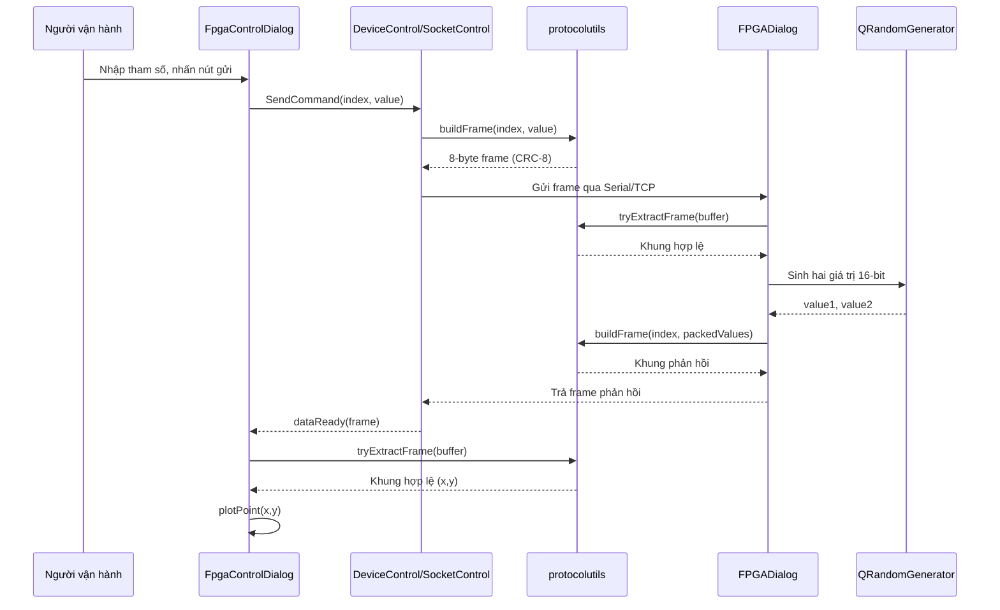

#Phân tích thiết kế

## 1. Yêu cầu đầu bài

### 1.1 Yêu cầu chức năng
- Ứng dụng cho phép chọn phương thức truyền thông Serial hoặc TCP, thực hiện kết nối tới thiết bị giả lập và chuyển các tham số điều khiển thành khung gói lệnh. Hai controller `DeviceControl` và `SocketControl` hiện thực hóa yêu cầu này, lần lượt dựa trên `SerialPort` và `QTcpSocket` của Qt.
- Giao diện `FpgaControlDialog` hỗ trợ hơn 20 loại tham số cấu hình, phát lệnh tương ứng và vẽ đồ thị 2D trục xy từ dữ liệu phản hồi. Mỗi nút bấm chuyển giá trị trong UI thành lệnh gửi, đồng thời module đồ thị cập nhật theo từng gói phản hồi.
- Thiết bị mô phỏng cần tiếp nhận cả Serial lẫn TCP, xác thực CRC-8, sau đó trả về hai giá trị 16-bit ngẫu nhiên trong một khung phản hồi để kiểm thử.

### 1.2 Phi chức năng
- Giao thức dữ liệu thống nhất 8 byte với header/footer cố định và CRC-8 đa thức `0x8C`, tránh trùng lặp khi nhiều thành phần phải đóng gói/giải mã khung lệnh. Bộ hàm trong `protocolutils` chịu trách nhiệm tính CRC, đóng gói và phân tích khung.
- Việc cập nhật giao diện cần giữ trải nghiệm mượt mà: biểu đồ sử dụng tối đa 500 điểm để tránh quá tải UI, đồng thời tự động mở rộng/thu nhỏ trục khi dữ liệu vượt ngưỡng.
- Hệ thống phải sẵn sàng mở rộng thêm lệnh mà không ảnh hưởng giao thức: cấu trúc `CommandStruct` được ép packed 1 byte, đảm bảo tính tương thích nhị phân giữa mọi thành phần.

## 2. Phân tích sơ đồ thuật toán & luồng dữ liệu

### 2.1 Luồng điều khiển từ Client tới thiết bị

### 2.2 Các tình huống lỗi chính
- **Mất kết nối Serial**: `SerialPort` phát tín hiệu `disconnected()` khi gặp `QSerialPort::ResourceError`, giúp `DeviceControl` đóng cổng và cập nhật trạng thái giao diện.
- **Khung dữ liệu không hợp lệ**: `protocol::tryExtractFrame` bỏ qua dữ liệu nhiễu bằng cách tìm lại header/footer và kiểm tra CRC trước khi trả khung hợp lệ.
- **TCP client rớt kết nối**: `SocketControl` đóng socket khi trạng thái là `Unconnected`, đồng thời phát tín hiệu để UI cập nhật. Thiết bị mô phỏng cũng dọn dẹp buffer từng client khi ngắt kết nối.

## 3. Phân tích thiết kế thành phần

| Thành phần | Vai trò | Điểm mạnh | Hạn chế/Nguy cơ |
|------------|---------|-----------|----------------|
| `MainWindow` | Chọn phương thức kết nối, khởi tạo dialog điều khiển | Cách ly logic UI chính khỏi khung điều khiển, phát tín hiệu để dialog cấu hình đăng ký controller phù hợp | Quản lý vòng đời controller bằng con trỏ |
| `DeviceControl` & `SerialPort` | Gói lệnh thành frame và viết ra Serial | Tập trung hóa cấu hình cổng, truyền tải dữ liệu theo chuẩn chung | Chưa có cơ chế reconnect tự động hay timeout; thiếu logging cấu trúc cho dữ liệu gửi đi.|
| `SocketControl` | Bao bọc `QTcpSocket`, phát tín hiệu trạng thái | Đăng ký đầy đủ signal/slot để UI phản ứng kịp thời, tái sử dụng `protocolutils` giống Serial | Không có buffer riêng để xử lý gói bị cắt rời; việc đọc dữ liệu chuyển thẳng lên UI khiến dialog phải tự quản lý buffer|
| `FpgaControlDialog` | Trung tâm tương tác người dùng và biểu đồ | Gom mọi thao tác gửi/nhận; biểu đồ tự động scale, giới hạn số điểm để đảm bảo hiệu năng | Số lượng slot nút bấm lớn, khó bảo trì; có thể rút gọn bằng map cấu hình lệnh; chưa phân tách rõ giữa logic giao thức và xử lý đồ thị.|
| `FPGADialog` | Thiết bị mô phỏng Serial/TCP | Dùng chung `protocolutils` giúp phản hồi đúng định dạng; tạo giá trị test ngẫu nhiên | Chưa hiện thực cấu hình đầy đủ như FPGA thật; server TCP không giới hạn số client, dễ quá tải; thiếu bảo vệ thread khi nhiều client cùng truy cập.|
| `protocolutils` | Tầng giao thức dùng chung | Đảm bảo tính nhất quán header/footer/CRC, xử lý buffer không đồng bộ | Hiện tại CRC đa thức được hard-code; nếu muốn thay đổi cần tái biên dịch; chưa có unit test đi kèm.|

## 4. Kịch bản demo/kiểm thử đề xuất

1. **Luồng Serial cơ bản**
   - Khởi động `MainWindow` và `FPGADialog`.
   - Chọn cổng `ttyV0`, nhấn *Open* để kết nối Serial.
   - Gửi một vài lệnh `Idx_PriMode`, `Idx_WfCtrl_MT`; xác nhận log phía FPGA hiển thị đúng command và biểu đồ vẽ ra điểm mới.
2. **Luồng TCP**
   - Nhập IP `127.0.0.1` và port `12345`, nhấn *Connect*.
   - Quan sát thông báo từ `FPGADialog` khi client mới kết nối và thử gửi lệnh; biểu đồ phải cập nhật tương tự luồng Serial.
3. **Xử lý gói lỗi**
   - Sử dụng script mô phỏng gửi chuỗi byte không đúng CRC để kiểm tra `protocol::tryExtractFrame` bỏ qua dữ liệu và hệ thống tiếp tục hoạt động bình thường.
4. **Giới hạn biểu đồ**
   - Tự động phát nhiều phản hồi (>500 điểm) và xác nhận biểu đồ vẫn mượt nhờ cơ chế giới hạn điểm cũ.

## 5. Đánh giá và đề xuất cải tiến

### 5.1 Điểm mạnh
- Kiến trúc chia lớp rõ ràng: giao thức dùng chung, controller tách biệt UI, thiết bị mô phỏng tái sử dụng cùng logic.
- Dễ mở rộng danh sách lệnh: các index được khai báo tập trung trong enum, giúp đồng bộ client và thiết bị mô phỏng.
- Khả năng kiểm thử end-to-end ngay trên máy phát triển nhờ mô phỏng Serial/TCP song song trong một project.

### 5.2 Hạn chế
- Việc sử dụng con trỏ thô cho controller dẫn tới nguy cơ rò rỉ và khó tái sử dụng; nên thay bằng `std::unique_ptr` hoặc `QObject` parent/child để Qt tự giải phóng.
- Thiếu kiểm soát buffer và xử lý lỗi ở tầng giao thức cho TCP/Serial (ví dụ giới hạn kích thước, timeout, phản hồi lỗi CRC).
- Hộp thoại điều khiển chứa quá nhiều slot gần như lặp lại; cần tái cấu trúc bằng cách cấu hình bảng mapping `index -> widget/nút` để giảm mã trùng và dễ thêm lệnh mới.

### 5.3 Đề xuất
- Bọc controller trong `std::unique_ptr` và truyền quyền sở hữu rõ ràng; tận dụng *parenting* của Qt để tự động giải phóng khi cửa sổ đóng.
- Tách `plotPoint` và xử lý buffer sang một lớp view-model nhẹ để giảm tải cho dialog, đồng thời thêm unit test cho `protocolutils`.
- Bổ sung logging có cấu trúc (ví dụ `QLoggingCategory`) cho cả hướng gửi và nhận để dễ truy vết khi tích hợp với thiết bị thật.
- Mở rộng thiết bị mô phỏng hỗ trợ tập lệnh đa dạng hơn (đọc/ghi trạng thái) và giới hạn số client TCP để tránh chiếm dụng tài nguyên.
